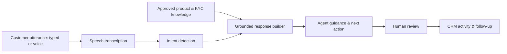
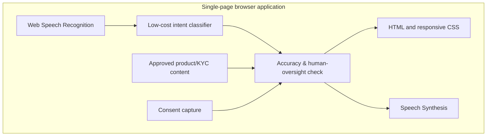

# Nyx — AI Voice Co-Pilot for Inside Sales

Nyx is a zero-backend MVP for the pay-in-3, zero-cost EMI affordability use case. It assists an inside-sales agent during a customer call: capturing consent, detecting intent, retrieving approved talking points, guiding onboarding/KYC, and producing an agent-reviewed CRM follow-up.

## Demo

Open [`outputs/pay-in-3-voice-copilot.html`](outputs/pay-in-3-voice-copilot.html) in Chrome or Edge.

## What it does

- Captures an AI-assistance consent state before the simulated call.
- Lets an agent type or speak a customer utterance, then recognizes product, KYC, hesitation, or onboarding intent.
- Gives source-grounded talk tracks and next-best actions while explicitly avoiding approval promises and unverified terms.
- Tracks onboarding steps, drafts CRM activity, and produces a follow-up that requires agent approval.
- Uses synthetic data only; it never collects or transmits personal/financial data.

## Product flow

## Architecture

## Run locally

No installation or server is required.

1. Clone the repository.
2. Open `outputs/pulse-ai-copilot.html` in a current Chrome or Edge browser.
3. Try one of the sample customer scenarios, type an utterance, or select **Speak** and grant microphone permission.
4. Review the guidance, complete the onboarding checklist, and save the simulated CRM activity.

## Voice support

Voice output uses the widely available Web Speech Synthesis API. Voice input depends on the browser's Speech Recognition support and microphone permission. If speech recognition is unavailable, text scenarios continue to work.

## Guardrails

- Obtain and record customer consent before recording or AI assistance.
- Keep transcripts, CRM data, and financial identifiers in approved secure systems; this demo uses no real customer data.
- Treat product/offer/KYC content as a source-of-truth retrieval problem and flag unknown or stale content rather than guessing.
- Keep final credit/loan terms and sensitive decisions with the authorized human and approved lender workflow.
- Require agent approval before CRM follow-ups are sent.

## Cost-aware AI workflow

The demo illustrates a model router: a low-cost intent classifier handles routine utterances (roughly ₹0.08 per decision in the demo), while a higher-capability retrieval-and-reasoning model is reserved for ambiguous or high-stakes cases. In production, deterministic rules and a small open-source classifier can handle consent, intent routing, and checklist states; a retrieval system can ground product and KYC responses.

## Next production milestones

1. Integrate consent-aware call transcription, CRM APIs, and an approved product/KYC source of truth.
2. Add retrieval augmented generation, prompt injection defenses, authentication, role-based access, and audit logs.
3. Evaluate accuracy against successful and unsuccessful historical calls, with human quality review and rollback paths.
4. Add consent/privacy controls appropriate for applicable Indian telecom and data-protection requirements.

## Technology

Vanilla HTML, CSS, and JavaScript; Web Speech APIs; no third-party dependencies.

## Status

This repository is a front-end MVP. It uses synthetic examples only and is not connected to telephony, a CRM, an LLM provider, or a production KYC system.
