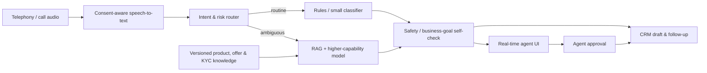

# Nyx technical write-up

## Architecture

## AI workflow

1. Capture explicit consent and store it with call metadata.
2. Transcribe the customer’s current utterance.
3. Use a low-cost classifier for intent, urgency, and risk routing.
4. Retrieve only current, approved product and KYC content for factual guidance.
5. Run a self-check against business goals: consent present, terms grounded, no approval promise, and a human owns sensitive decisions.
6. Show a suggested response and next best action to the agent; never auto-send it.
7. Draft CRM notes/follow-up and require agent approval.

## Stack in this MVP

Vanilla HTML, CSS, JavaScript, Web Speech Recognition where available, and Speech Synthesis. Production additions: telephony provider, consent-aware transcription, CRM adapter, a versioned knowledge base, retrieval service, model gateway/router, audit logging, analytics, and identity/access control.
